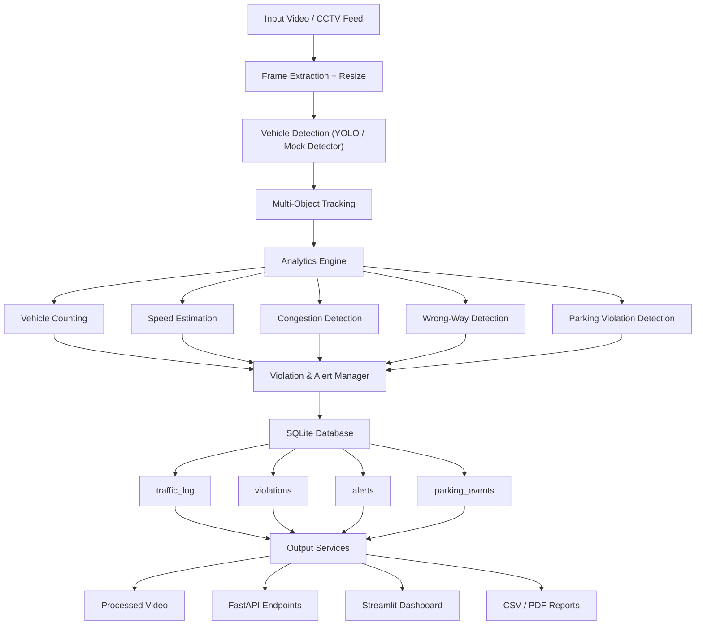

# SmartCityAI: Software-Based Traffic Monitoring and Violation Detection System

SmartCityAI is a comprehensive traffic monitoring and analytics software system that processes traffic camera feeds, tracks vehicles, calculates real-time speeds, estimates road congestion levels, and flags violations (wrong-way traffic and illegal parking). Results are stored in an SQLite database, exposed through a FastAPI backend, and visualized on a premium Streamlit dashboard with snapshot evidence.

---

## 📐 System Architecture

Below is the workflow showing how video frames progress from extraction through tracking, analytics processing, and database storage, up to output generation:

---

## 🎛️ Operational Modes

The system operates in two modes, toggled dynamically by the `SMARTCITYAI_MOCK` environment variable:

### Mode A: Real YOLOv8 Mode (AI Detection)
- **Execution**: Run normally without the mock environment variable set.
- **Workflow**: Uses the pre-trained `yolov8n.pt` model to detect classes `car` (2), `motorcycle` (3), `bus` (5), and `truck` (7) from actual video frames.
- **Use Case**: Deployment on real road CCTV video feeds or live testing.

### Mode B: Mock Simulation Mode (Pipeline Simulation)
- **Execution**: Enabled by setting `$env:SMARTCITYAI_MOCK="1"` (Windows) or `SMARTCITYAI_MOCK=1` (Linux).
- **Workflow**: Bypasses the GPU/CPU deep learning inference and generates simulated, predictable vehicle bounding box paths. 
- **Use Case**:
  - Offline testing in low-resource environments (no GPU or slow hardware).
  - Bypassing internet downloads for YOLO weight files (`yolov8n.pt`).
  - Running deterministic test suites to verify that counting, congestion thresholds, database logging, alerts, and dashboard renderers function correctly.

---

## ⚙️ Configurable Lane, ROI & Calibration System

To accommodate different camera angles and road geometries, all spatial settings are fully configurable in `src/utils/config.py`:
- **`ROI_POLYGON`**: A list of `[x, y]` coordinates defining a Region of Interest. Vehicles detected outside this boundary (e.g. adjacent buildings or sidewalks) are ignored by the tracking loop.
- **`COUNTING_LINE_Y`**: The horizontal line y-coordinate where vehicles crossing downwards trigger a count update.
- **`WRONG_WAY_ALLOWED_DIRECTION`**: The expected traffic flow direction (`left_to_right` or `right_to_left`).
- **`PARKING_ZONE_COORDS`**: `[x, y]` coordinates representing illegal parking zones where stationary vehicles are monitored.

---

## 🏎️ Calibrated Speed Estimation

To translate video frame movements into real-world speeds (km/h), the system uses pixel-to-distance mapping variables:
- **`SPEED_REFERENCE_DISTANCE_PIXELS`**: Measured distance in pixels along a known segment of the road in the camera view (e.g., `180` pixels).
- **`SPEED_REFERENCE_REAL_METERS`**: The actual physical length of that road segment in meters (e.g., `10` meters).
- **Calibration Formula**:
  $$\text{Pixels per Meter} = \frac{\text{Reference Distance in Pixels}}{\text{Reference Real Distance in Meters}}$$
  $$\text{Speed (m/s)} = \frac{\text{Frame Displacement (pixels)} \times \text{FPS}}{\text{Pixels per Meter}}$$
  $$\text{Speed (km/h)} = \text{Speed (m/s)} \times 3.6$$

### ⚠️ Calibration Limitation Warning
Without formal 3D camera calibration (handling camera focal length, tilt angle, and perspective distortion), estimated speeds are approximations intended for traffic density statistics and not for legal speed enforcement.

---

## 📈 Evaluation & Test Results

The system has been verified using a synthetic test video modeling car, motorcycle, bus, and truck movements:

| Test Case | Input | Expected Result | Actual Result | Status |
| :--- | :--- | :--- | :--- | :--- |
| **Vehicle Counting** | Synthetic video with 4 vehicles | Total vehicle count equals 3 crossing the threshold (1 remains parked above the line) | 3 vehicles counted (1 car, 1 bus, 1 truck) | **Pass** ✅ |
| **Wrong-Way Detection** | Vehicle 3 moving right-to-left | Trigger Wrong-Way violation; log ID and details to DB | Wrong-Way violation logged for Vehicle 3 | **Pass** ✅ |
| **Parking Detection** | Vehicle 2 stationary > 20s | Trigger Illegal Parking violation; save screenshot evidence | Illegal Parking violation logged for Vehicle 2 with image | **Pass** ✅ |
| **API Endpoint test** | `GET /violations` request | Return JSON array of logged database violations | Returns structured JSON with frame, confidence, and image path | **Pass** ✅ |
| **Report Generation** | Execute report script | Create CSV and PDF summaries under `outputs/reports/` | Both reports generated with updated schema columns | **Pass** ✅ |

---

## 🚧 System Limitations

- **Speed Estimation**: The 2D pixel-to-meter scaling is linear and does not adjust for perspective warping (objects appearing smaller as they move further away).
- **Occlusions**: Centroid tracking may drop or duplicate vehicle IDs if vehicles overlap or pass behind street signs.
- **SQLite Database**: Suitable for development, prototypes, and low-frequency edge logging, but not optimized for multi-camera city-scale concurrent transactions.
- **Lane Detections**: Direction checking is coordinate-based and does not adapt automatically to roads with curved lanes without manual ROI tuning.

---

## 🔮 Future Roadmap

1. **RTSP Live Feeds**: Integrating direct RTSP or CCTV video streaming feeds.
2. **Automatic Number Plate Recognition (ANPR)**: Integrating OCR to extract license plate details of violating vehicles.
3. **Helmet & Safety Violations**: Adding motorcycle rider classification models to detect missing helmets or seatbelts.
4. **Traffic Light Optimization**: Connecting the congestion density level (LOW/MEDIUM/HIGH/CRITICAL) to dynamically update traffic light signal timers.
5. **Centralized Cloud Sync**: Shipping SQLite logs or edge frames to a PostgreSQL/MySQL database server on AWS or GCP.
